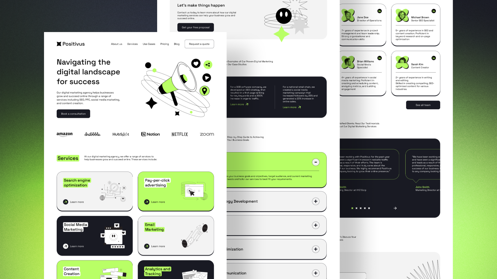

# Positivus - Digital Marketing Agency Landing Page


**Keywords:** Digital Marketing, Marketing Agency, SEO, Social Media Marketing, Content Marketing, Web Design, Landing Page, Next.js, React

## Project Overview

Positivus is a modern landing page for a digital marketing agency. Built with Next.js, React, TypeScript, and Tailwind CSS. This project showcases a professional, responsive design with smooth animations and optimized performance.


## Design

The design is available on Figma:
- [Positivus Landing Page Design](https://www.figma.com/design/4WvNy3W0mlZ5nG4AkttL9F/Positivus-Landing-Page-Design--Community-?node-id=341-566&t=8ar0O5SVwY8ostHa-0)

Design by the Figma Community. The design includes complete mockups, component specifications, and design system guidelines.

## Getting Started

### Prerequisites
- Node.js 18+ or Bun
- pnpm (recommended) or npm/yarn

### Installation and Development

First, install dependencies:

```bash
pnpm install
# or
npm install
```

Then, run the development server:

```bash
pnpm dev
# or
npm run dev
```

Open [http://localhost:3000](http://localhost:3000) with your browser to see the result.

You can start editing the page by modifying `app/page.tsx`. The page auto-updates as you edit the file.

### Scripts

- `pnpm dev` - Start development server
- `pnpm build` - Build for production
- `pnpm start` - Start production server
- `pnpm lint` - Run ESLint
- `pnpm lint:fix` - Fix ESLint issues automatically
- `pnpm format` - Format code with Prettier
- `pnpm format:check` - Check code formatting

## Technologies

- **Framework**: Next.js 16
- **UI Library**: React 19
- **Language**: TypeScript
- **Styling**: Tailwind CSS 4
- **Code Quality**: ESLint, Prettier
- **Package Manager**: pnpm

## Contributing

Contributions are welcome! Please feel free to submit issues and pull requests.
